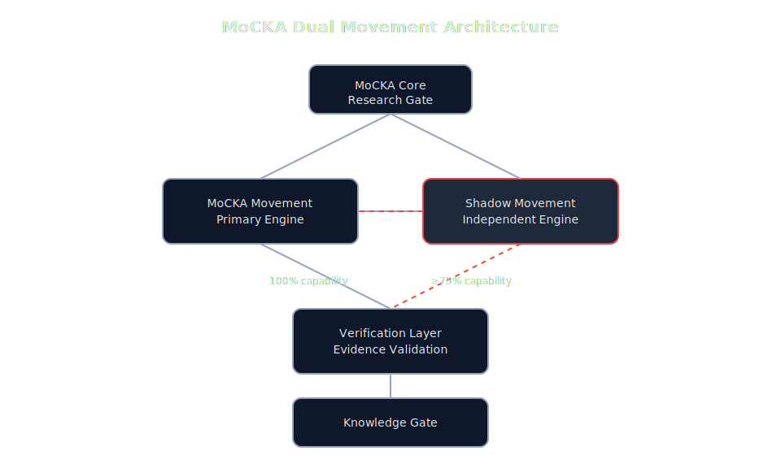
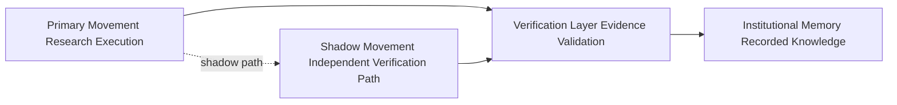

# MoCKA Insight System

Verifiable AI Civilization Architecture

MoCKA is a research-grade architecture designed for verifiable reasoning, institutional memory, and resilient knowledge circulation.

MoCKA は検証可能な推論、制度的記憶、知識循環の持続性を目的として設計された研究アーキテクチャです。

---

# Architecture

MoCKA structures knowledge verification and memory preservation through layered components that maintain traceable reasoning and long-term reproducibility.

MoCKA は推論履歴の追跡と長期的再現性を維持するための層構造アーキテクチャとして設計されています。

---

# Core Architecture Principle

MoCKA is built on a fail-safe design philosophy called Shadow Movement.

The system never assumes correctness.
Every primary process is paired with an independent shadow verification path.

Even if the primary process fails, the circulation of knowledge does not stop.
Instead, the system transitions into a Minimum Operating Capability mode designed to maintain approximately 75 percent operational capability.

MoCKA は Shadow Movement と呼ばれるフェイルセーフ設計思想に基づいて構築されています。

MoCKA は正しさを前提としない設計を採用しています。
すべての主要プロセスには独立したシャドー検証経路が存在します。

そのため障害が発生した場合でも知識の循環は停止せず、
Minimum Operating Capability（最低限稼働能力）を基準とした約75％の稼働能力を維持する設計となっています。

これは完全停止を回避し、知識循環を維持するための基本原理です。

Architecture principle reference

docs/SHADOW_MOVEMENT_PRINCIPLE.md

---

# Shadow Movement Architecture

## MoCKA Dual Movement Architecture

Primary Movement and Shadow Movement operate as a dual-heart architecture.
The primary path maintains full research execution capability, while the shadow path preserves knowledge circulation through independent verification.

Primary Movement は研究実行の主経路として100％能力で動作します。
Shadow Movement は独立した検証経路として相関的に接続され、
障害時でも Minimum Operating Capability（最低限稼働能力）として約75％以上の稼働能力を維持します。

この二重ムーブメント構造により、知識循環は停止しません。

Primary Movement
Main research execution path.

Shadow Movement
Independent verification path that preserves circulation when failures occur.

MoCKA uses a dual movement architecture conceptually similar to a mechanical clock with a redundant escapement.

Primary Movement
研究実行の主経路。

Shadow Movement
主経路に問題が発生した場合でも知識循環を維持する独立経路。

MoCKA は二重ムーブメント構造として設計されています。

---

# Repositories

| Layer | Role | Repository |
|------|------|-----------|
| MoCKA Core | Research gate and execution | https://github.com/m-sirius-k/MoCKA |
| Knowledge Gate | Institutional memory layer | https://github.com/m-sirius-k/MoCKA-KNOWLEDGE-GATE |
| Transparency | Audit and public verification | https://github.com/m-sirius-k/mocka-transparency |
| External Brain | External knowledge integration | https://github.com/m-sirius-k/mocka-external-brain |
| Civilization Layer | Governance philosophy | https://github.com/m-sirius-k/mocka-civilization |
| Core Private | Operational layer | Internal repository |

---

# Research Workflow

Experiment -> Experiment Registry -> Research Gate -> Verification -> Research Map

実験 -> 実験登録 -> Research Gate -> 検証 -> Research Map

This workflow ensures that research hypotheses, experiments, and validation steps remain traceable and reproducible.

このワークフローにより、仮説、実験、検証のすべてが追跡可能かつ再現可能な形で記録されます。

---

# Technical Backbone

## English

MoCKA includes an automated verification framework called Research Gate.

Research Gate continuously validates the architecture across several dimensions.

- system structure
- research registry integrity
- documentation consistency
- audit artifacts and verification evidence

Verification Status

RESEARCH_RUN OK
Verification controls executed 20
All verification checks passed

Meaning

The architecture is structurally valid and capable of executing reproducible research processes.

---

## 日本語

MoCKA には Research Gate と呼ばれる自動検証フレームワークが組み込まれています。

Research Gate は以下の項目を継続的に検証します。

- システム構造
- 研究登録情報の整合性
- ドキュメント整合性
- 監査証跡および検証証拠

検証結果

RESEARCH_RUN OK
検証実行数 20
すべての検証に成功

意味

アーキテクチャは構造的に整合しており、再現可能な研究プロセスを実行できる状態にあります。

---

# Verification Architecture

The following sections describe the verification controls used to validate the MoCKA architecture.

以下では MoCKA アーキテクチャの整合性を確認する検証項目を示します。

1 System Integrity Verification

ecosystem_doctor_integrity
ecosystem_structure_scan
canon_directory_integrity
artifact_directory_integrity
repo_entrypoints_present
repo_git_clean_check
repo_license_presence

2 Research Process Verification

experiments_minimum_coverage
research_registry_schema
research_map_registry_integrity
research_runner_selfcheck

3 Documentation Verification

readme_role_vocab_integrity
readme_research_entry_presence
docs_link_audit

4 Audit and Evidence Verification

gpg_signing_config_present
doctor_script_presence
doctor_artifact_schema
doctor_emit_json_artifact
doctor_sha_note_upsert
canon_notes_integrity

---

# MoCKA Vision

MoCKA aims to establish a Verifiable Knowledge Infrastructure for the AI era.

AI systems increasingly generate large volumes of knowledge.
MoCKA focuses on preserving integrity, traceability, and reproducibility for that knowledge.

MoCKA は AI 時代のための検証可能な知識基盤を構築することを目標としています。

AI によって生成される知識量が増加する中で、
その履歴、証明、再現性を維持する制度的基盤が必要になります。

MoCKA はそのための研究アーキテクチャです。

---

# Status

Research Stage Active Development

The architecture and verification framework are operational, and further expansion of the knowledge infrastructure is ongoing.

現在 MoCKA は研究開発段階にあり、
アーキテクチャと検証フレームワークは稼働しています。

今後さらに知識基盤の拡張が進められます。

# MoCKA Ecosystem

This repository is part of the **MoCKA Civilization Research Ecosystem**.

MoCKA studies AI civilization systems including governance, consensus and institutional memory.

## Ecosystem Structure

Research Core  
MoCKA

Civilization Theory  
mocka-civilization

Knowledge System  
mocka-knowledge-gate

Transparency Layer  
mocka-transparency

Network Layer  
mocka-outfield

Civilization Core (private)  
mocka-core-private

## 概要

このリポジトリは **MoCKA AI文明研究エコシステム** の一部です。

MoCKAはAI文明の制度、合意形成、知識継承を研究するプロジェクトです。

## 文明構造

研究コア  
MoCKA

文明理論  
mocka-civilization

知識システム  
mocka-knowledge-gate

透明性  
mocka-transparency

ネットワーク  
mocka-outfield

文明コア（非公開）  
mocka-core-private

