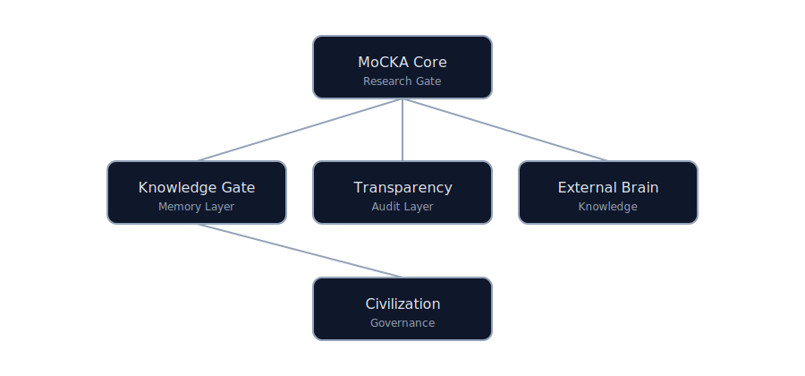
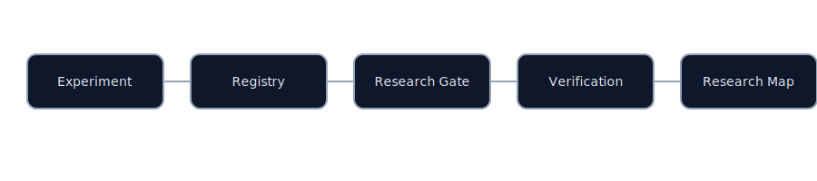

# MoCKA Ecosystem

Verifiable AI Civilization Architecture

MoCKA is a research-grade AI ecosystem designed for verifiable reasoning, institutional memory, and transparent governance.

MoCKA は、検証可能な AI 推論、制度的記憶、透明なガバナンスを目的とする研究エコシステムです。

---

# Architecture

---

# Repositories

| Layer | Role | Repository |
|------|------|-----------|
| MoCKA Core | Research gate and execution | [MoCKA](https://github.com/nsjpkimura-del/MoCKA) |
| Knowledge Gate | Institutional memory | [MoCKA-KNOWLEDGE-GATE](https://github.com/nsjpkimura-del/MoCKA-KNOWLEDGE-GATE) |
| Transparency | Audit and public proof | [mocka-transparency](https://github.com/nsjpkimura-del/mocka-transparency) |
| External Brain | External knowledge integration | [mocka-external-brain](https://github.com/nsjpkimura-del/mocka-external-brain) |
| Civilization | Governance philosophy | [mocka-civilization](https://github.com/nsjpkimura-del/mocka-civilization) |
| Core Private | Operational layer | Internal repository |

---

# Research Workflow

Experiment -> Experiment Registry -> Research Gate -> Verification -> Research Map

実験 -> 実験登録 -> Research Gate -> 検証 -> Research Map

---

# Technical Backbone

## English

MoCKA includes an automated verification system called **Research Gate**.

Research Gate verifies the ecosystem across:

- system structure
- research registry
- documentation integrity
- audit artifacts

Verification Status

RESEARCH_RUN: OK  
Verification controls executed: 20  
All verification checks passed.

Meaning

The ecosystem structure is valid and reproducible research can be executed.

---

## 日本語

MoCKA には **Research Gate** と呼ばれる自動検証システムが組み込まれています。

Research Gate は以下を検証します。

- システム構造
- 研究登録情報
- ドキュメント整合性
- 監査証跡

検証結果

RESEARCH_RUN: OK  
検証項目数: 20  
すべての検証に成功

意味

MoCKA エコシステムは研究実行可能な構造を持つことが確認されています。

---

# Verification Architecture

Click each section to expand and view the verification controls.

各項目をクリックすると展開され、検証内容が表示されます。

1 System Integrity Verification

ecosystem_doctor_integrity  
ecosystem_structure_scan  
canon_directory_integrity  
artifact_directory_integrity  
repo_entrypoints_present  
repo_git_clean_check  
repo_license_presence  

2 Research Process Verification

experiments_minimum_coverage  
research_registry_schema  
research_map_registry_integrity  
research_runner_selfcheck  

3 Documentation Verification

readme_role_vocab_integrity  
readme_research_entry_presence  
docs_link_audit  

4 Audit and Evidence Verification

gpg_signing_config_present  
doctor_script_presence  
doctor_artifact_schema  
doctor_emit_json_artifact  
doctor_sha_note_upsert  
canon_notes_integrity  

---

# Quick Demo

## English

This page introduces the MoCKA verification system.

To experience the verification demonstrations and research test environment, open the Demo Arena.

All demonstrations, validation runs, and researcher tests are organized there.

### Open Demo Arena

[DEMO_ARENA](./VERIFICATION_ARENA.md)

---

## 日本語

このページでは MoCKA の検証システムを紹介しています。

検証デモや研究テストを体験するには、デモ会場を開いてください。

すべてのデモと検証テストはデモ会場で管理されています。

### デモ会場

[DEMO_ARENA](./VERIFICATION_ARENA.md)
