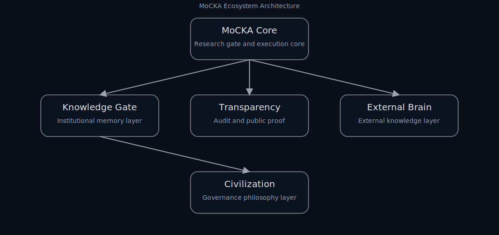

# MoCKA Ecosystem

Verifiable AI Civilization Architecture.

MoCKA is a research-grade AI ecosystem designed for verifiable reasoning, institutional memory, and transparent governance.

MoCKA は、検証可能な AI 推論、制度的記憶、透明なガバナンスを目的とする研究エコシステムです。

---

## Architecture

---

## Repositories

MoCKA Core  
Research gate and execution core  
[Open MoCKA Core](https://github.com/nsjpkimura-del/MoCKA)

Knowledge Gate  
Institutional memory layer  
[Open Knowledge Gate](https://github.com/nsjpkimura-del/MoCKA-KNOWLEDGE-GATE)

Transparency  
Audit and public proof  
[Open Transparency](https://github.com/nsjpkimura-del/mocka-transparency)

External Brain  
External knowledge layer  
[Open External Brain](https://github.com/nsjpkimura-del/mocka-external-brain)

Civilization  
Governance philosophy layer  
[Open Civilization](https://github.com/nsjpkimura-del/mocka-civilization)

Core Private  
Operational private layer  
Private repository

---

## Research Workflow

Experiment -> Experiment Registry -> Research Gate -> Verification -> Research Map

---

## Quick Demo

powershell -ExecutionPolicy Bypass -File MoCKA/tools/mocka_research_run.ps1

---

## Technical Backbone

RESEARCH_RUN: OK  
Registered experiments: 20  

ecosystem_doctor_integrity  
repo_entrypoints_present  
experiments_minimum_coverage  
gpg_signing_config_present  
readme_role_vocab_integrity  
doctor_emit_json_artifact  
doctor_sha_note_upsert  
research_map_registry_integrity  
readme_research_entry_presence  
ecosystem_structure_scan  
repo_git_clean_check  
repo_license_presence  
canon_directory_integrity  
artifact_directory_integrity  
research_registry_schema  
doctor_script_presence  
doctor_artifact_schema  
canon_notes_integrity  
research_runner_selfcheck  
docs_link_audit

---

# System Integrity Verification

## 定義

・Ecosystem 構造が設計仕様と一致する  
・制度記録領域（canon）が存在する  
・成果物領域（artifact）が存在する  
・各リポジトリに入口ドキュメントが存在する  
・Git 状態が再現可能である  
・公開ライセンスが存在する  

## 検査項目

1 ecosystem_doctor_integrity  
Ecosystem 全体の整合性を確認する  

2 ecosystem_structure_scan  
ディレクトリ構造と repository 構成を検査する  

3 canon_directory_integrity  
制度記録領域 canon の構造を検査する  

4 artifact_directory_integrity  
成果物領域 artifact の構造を検査する  

5 repo_entrypoints_present  
各リポジトリに入口ドキュメントが存在することを確認する  

6 repo_git_clean_check  
Git working tree が clean であることを確認する  

7 repo_license_presence  
公開リポジトリにライセンスファイルが存在することを確認する  

## 詳細な検査内容

[Verification Details](docs/verification/system_integrity.md)

